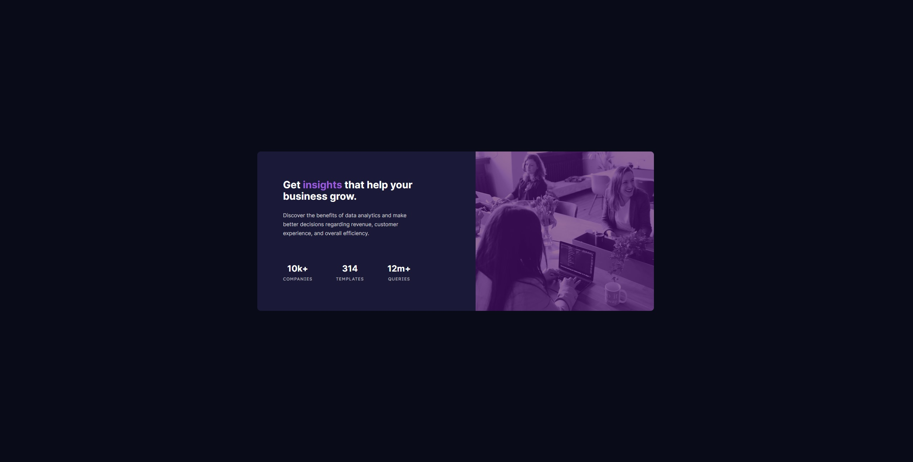

# Frontend Mentor - Stats preview card component solution

This is a solution to the [Stats preview card component challenge on Frontend Mentor](https://www.frontendmentor.io/challenges/stats-preview-card-component-8JqbgoU62). Frontend Mentor challenges help you improve your coding skills by building realistic projects. 

## Table of contents

- [Overview](#overview)
  - [The challenge](#the-challenge)
  - [Screenshot](#screenshot)
  - [Links](#links)
- [My process](#my-process)
  - [Built with](#built-with)
  - [What I learned](#what-i-learned)
  - [Continued development](#continued-development)

**Note: Delete this note and update the table of contents based on what sections you keep.**

## Overview

### The challenge

Users should be able to:

- View the optimal layout depending on their device's screen size

### Screenshot

### Links

- Solution URL: [Add solution URL here](https://your-solution-url.com)
- Live Site URL: [Add live site URL here](https://your-live-site-url.com)

## My process

Small sceen version -> big screen

### Built with

 -HTML
 -CSS
 
 Via VCS

**Note: These are just examples. Delete this note and replace the list above with your own choices**

### What I learned

 - order: 1/2 in a flex box mode // Didn't know about that option.  
 - Trick to change a greyscale color into duotone. 
 - Use of filter and how they work/interact 

### Continued development

Going throught the "easy" challenge to continue explore and getting use with all the Html and Css tools 
